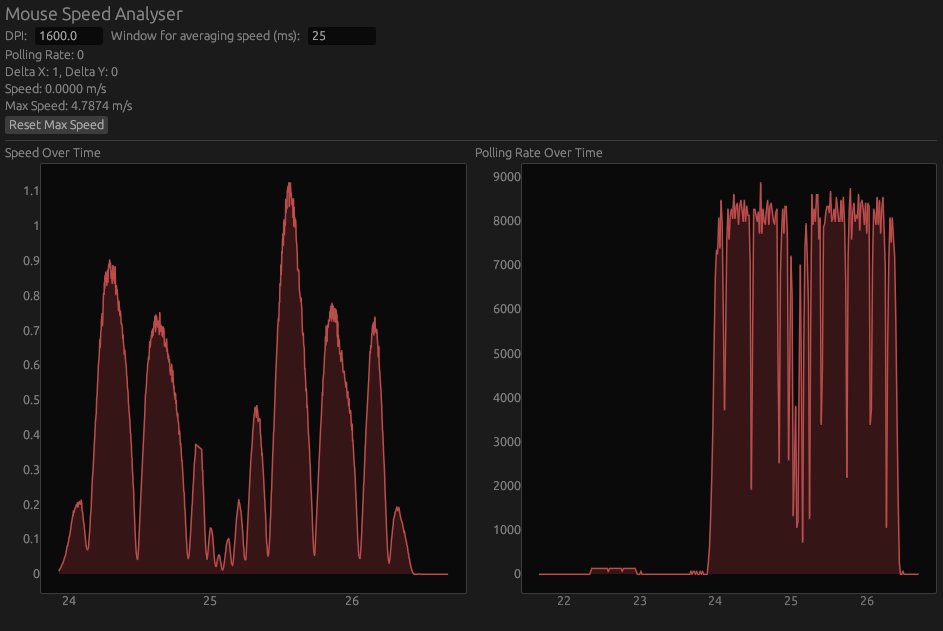

# Mouse Speed Analyser
This is a simple tool that uses raw input to visualize mouse speed, and to test your maximum flick speed. It also provides accurate polling rate data.
The calculation for mouse speed requires the DPI to be set in the UI (since calculation for raw input is based on inches per second modified by the DPI).

## Limitations
- Currenly the window needs to be in focus to capture the full polling rate.

## Installation

### Prerequisites
- Rust installed ([Install Rust](https://www.rust-lang.org/tools/install))

### Clone the repository
```sh
git clone https://github.com/Dylan-B-D/mouse-speed-analyser.git
cd mouse-speed-analyser
```

### Run
```sh
cargo run
```

### Build Executable
```sh
cargo build --release
```

## Usage
- Launch the application.
- Enter your mouse's DPI for accurate speed calculation.
- Adjust the window duration for speed averaging.
- View live speed, max speed, and polling rate.
- Click "Reset Max Speed" to clear the highest recorded speed.

## Screenshot


## Dependencies
- `egui` and `eframe` for GUI
- `egui_plot` (for graph visualization)
- `multiinput` (for raw mouse input handling)

## License
This project is licensed under the [MIT License](LICENSE). See the LICENSE file for details.

## Author
[Dylan-B-D](https://github.com/Dylan-B-D)

